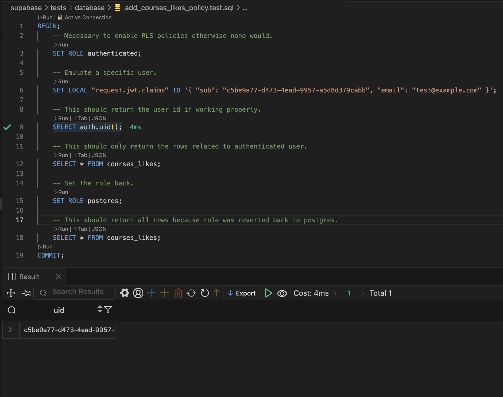
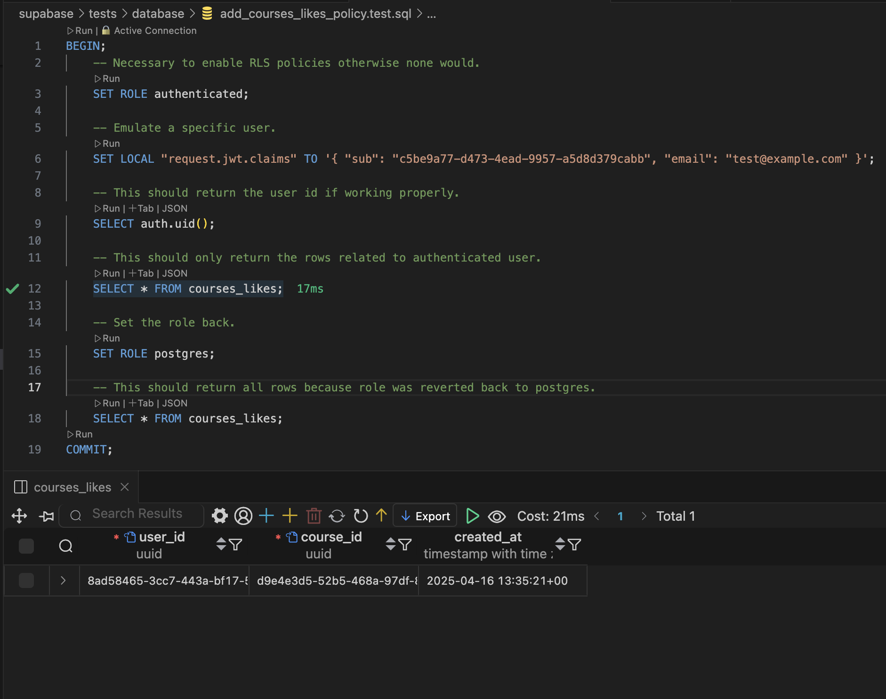
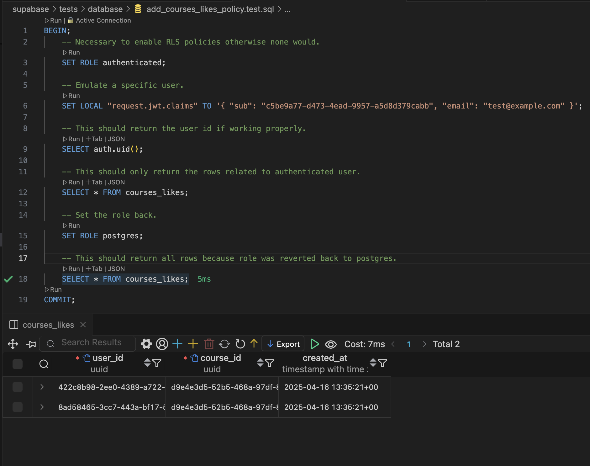
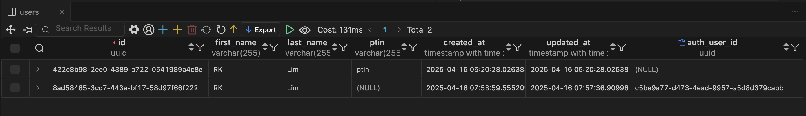

## Add RLS Policy to Liked Courses

Added migration file to implement policy,
`20250416060418_add_courses_likes_policy.sql`.

### Testing

Checking if correct `auth ID` is set.

Checking if selecting all rows in `courses_likes` table will only return authenticated user data.

Lastly, checking when role is reverted back to `postgres`, it will show all rows of `courses_likes`.

#### Also, here's the `users` rows for reference.
