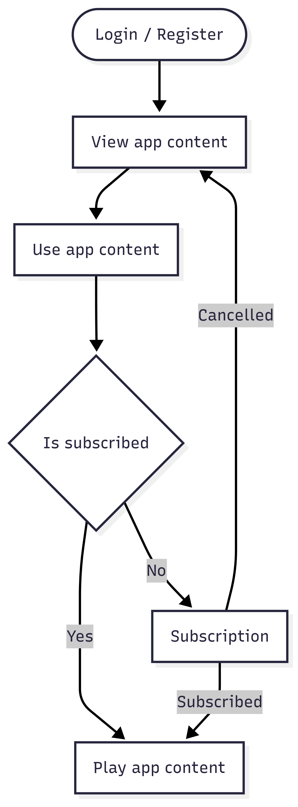
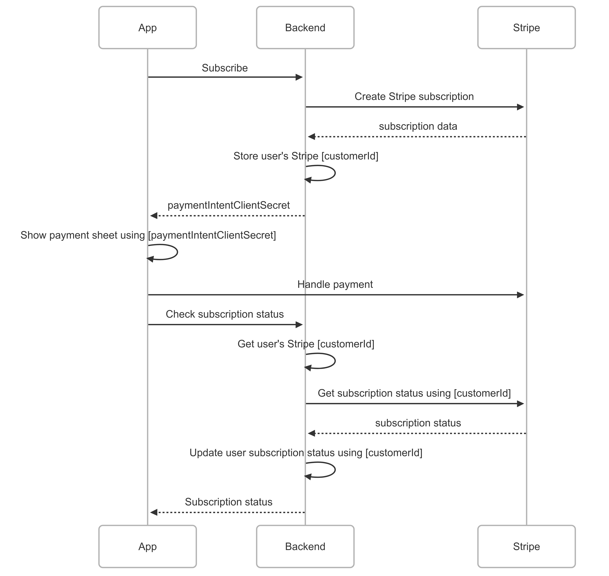
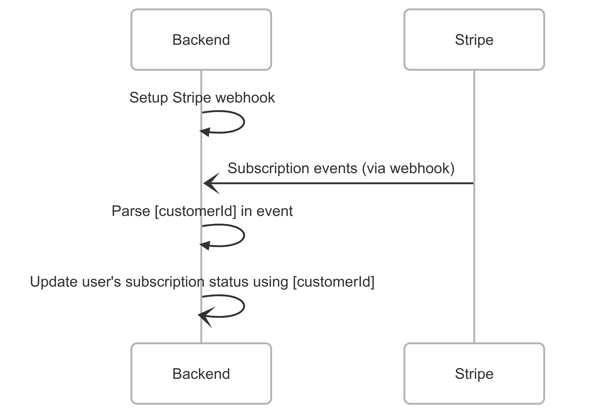
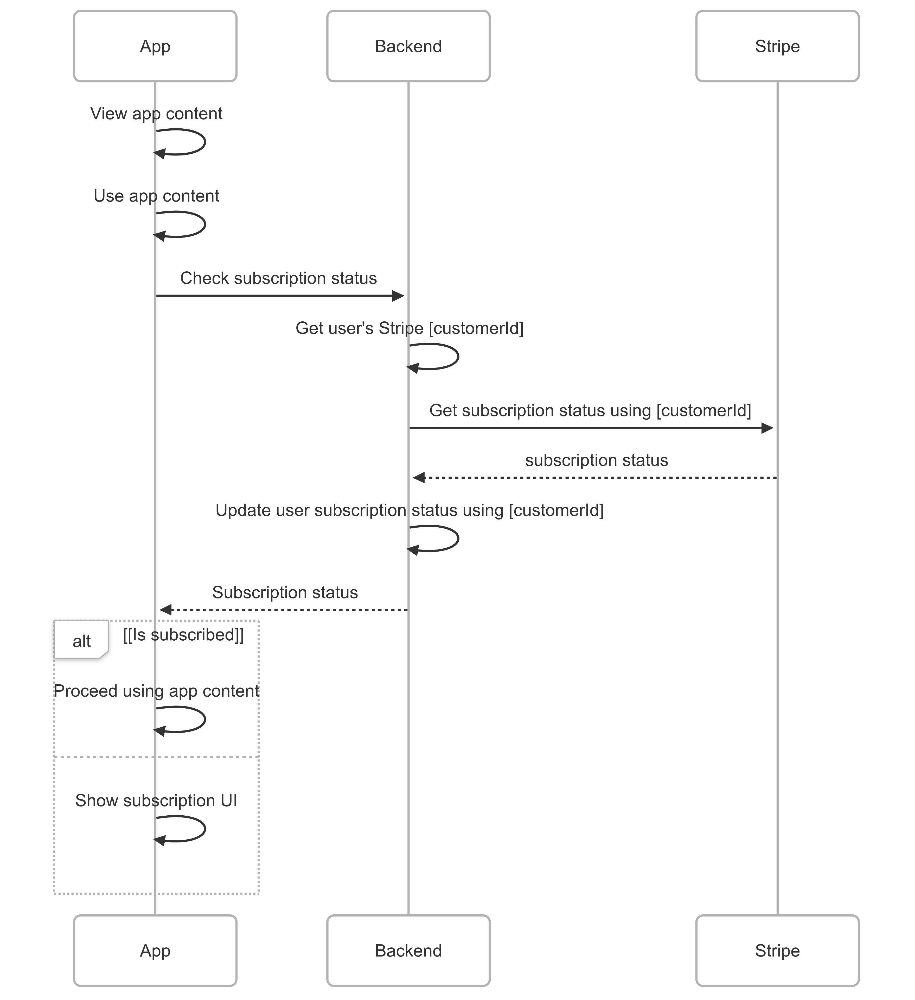

## Payment Processing System

There are many ways to integrate payment subscription for mobile and web. The most popular ones are using Stripe (web and mobile), Google Play Billing (Android), and StoreKit (iOS).

The next thing we should consider are the subscription scenarios.

1. Subscription could block app access entirely.
    - Unsubscribed users cannot access app contents.
    - Possible bad review in stores.
    - Low subscription rate. Users will be hesitant to subscribe for they don't have a glimpse of the app contents.
    - Need different way to showcase app contents.

2. Can view app contents and just require subscription when using it.
    - Unsubscribed users has a chance to view app contents.
    - Better review score.
    - Has a better subscription rate.
    - No need to worry on other ways to showcase app contents.

3. Can view app contents and use it for a limited amount of time (may refresh every day, week, etc.), then require subscription to continue using the contents.
    - Unsubscribed users has a chance to view and use app contents.
    - Could have mixed reviews. Time limit could annoy some users.
    - Has a better subscription rate. Users can properly decide if our contents are worth paying.
    - No need to worry on other ways to showcase app contents.

4. Free contents and paid contents.
    - Happy unsubscribed users. More users.
    - Could have the best review score.
    - Could lower the subscription rate. Users may be satisfied with the free contents.
    - No need to worry on other ways to showcase app contents.

In this document, it will focus more on using Stripe and the subscription scenario #2, `"Can view app contents and just require subscription when using it"`. We can first observe how it performs, then we can make #3 or #4 as an improvement.

### Subscription flow
---

### Payment provider
---
#### Stripe

Has a Flutter plugin, web and server SDK.

- [flutter_stripe](https://pub.dev/packages/flutter_stripe)
- [React Stripe.js](https://docs.stripe.com/sdks/stripejs-react) or [ES Module Stripe.js](https://docs.stripe.com/sdks/stripejs-esmodule)
- [server-side](https://docs.stripe.com/sdks/server-side)
- More SDKs: https://docs.stripe.com/sdks

Here's a high level design for the subscription flow using Stripe.

For the subscription status background update.

And here's the flow when accessing app content

---
#### Other providers

As an alternative to Stripe, I'll just also list here the possible providers we can use.

| Feature | Stripe 🧱 | RevenueCat 🐱 | Qonversion 🔄 |
| ------- | ------- | ------- | ------- |
| ✅ Flutter SDK | ✅ Yes (flutter_stripe) | ✅ Yes (official) | ✅ Yes (official) |
| 🌐 Web Support | ✅ Full (native Stripe) | ❌ No | ✅ Yes (via Stripe) |
| 💳 Subscription Support | ✅ Web + manual IAP | ✅ Native IAP only | ✅ Native IAP + Web (Stripe) |
| ⚙️ Webhooks Needed | ✅ Yes | ❌ No | ❌ No (optional) |
| 💰 Pricing | 2.9% + 30¢ per txn | Free → paid by MAU | Free → paid by MAU |